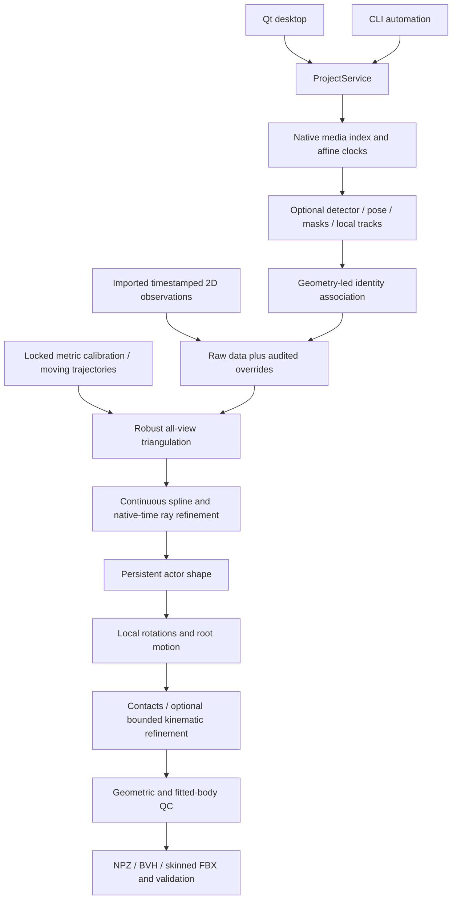

# Project state and desktop migration record

Audited **2026-10-06** against the entire tracked repository, source implementations, tests, configuration, manuals and actual installation. This is a source-verified engineering handoff, not a production-readiness certificate. See [AGENTS.md](AGENTS.md) for development rules and commands and [SESSION_HANDOFF.md](SESSION_HANDOFF.md) for owner requirements and session context.

## Goal and current result

The original goal is an open-source, production-oriented markerless RGB multi-camera VFX application: arbitrary static/moving calibrated cameras and asynchronous timestamps produce metric global motion, persistent actor proportions, skeletal rotations, contacts and a fitted SMPL-family character. The main deliverable must be a conventional animated, rigged, skinned FBX with constant topology. A coherent desktop GUI, CLI automation, resumable processing, inspectable uncertainty/reprojection QC, isolated dependencies and an operator manual are required.

The current release is **0.1.0, an engineering preview**. Its working vertical slice starts with calibrated, timestamped observations and finishes with real rig/skin/animation export and QC. The included deterministic example uses an explicitly generated technical mannequin, not SMPL. Numerical body-model support exists, but no licensed SMPL-family asset or downloaded production neural checkpoint has been executed. CPU/synthetic tests cannot establish real capture accuracy, GPU compatibility or production GUI completeness.

## Capability matrix

`WORKING` means implemented and executed within the stated scope. `PARTIAL` means usable components with missing integration or coverage. `BLOCKED_EXTERNAL` identifies an actual missing asset/tool/access. `NOT_STARTED` identifies missing implementation rather than an interface.

| Subsystem | State | Actual scope and remaining limit |
|---|---|---|
| Isolated environment, lock, launcher, doctor | WORKING | Linux/CPU install; packages/cache/temp under the install root. No complete GPU or tested Windows/macOS installer. |
| Typed camera/observation/body/scene contracts | WORKING | Provenance, confidence and parameter controls; project/service boundaries also use validated dictionaries. |
| Distorted camera projection and coordinate conversion | WORKING | OpenCV radial/tangential/rational/higher-order and fisheye, metric +Y world, moving sampled extrinsics/intrinsics. |
| Calibration tools and imports | PARTIAL | Target intrinsics, surveyed PnP, OpenCV/COLMAP text/limited Metashape imports and bounded static-camera refinement. GUI target/correspondence solving is incomplete. |
| Static-scene camera tracking | BLOCKED_EXTERNAL | COLMAP integration/masking helpers exist; executable unavailable here, full imagery-to-moving-camera workflow unverified. |
| Native media timestamps/decoding | WORKING | FFprobe VFR PTS, sequence sidecars/natural ordering, dropped/duplicate diagnostics, bounded decoding. GUI bypasses portions of this path: see bugs below. |
| Affine synchronization APIs | WORKING | Events, comparable signals, sub-frame offset/drift and bounded reprojection refinement against an existing frozen trajectory. |
| Automatic synchronization workflow | PARTIAL | No audio/flash event extractor or waveform workspace; new full solves apply supplied clocks rather than automatically solving every synchronization source. |
| Person/pose/mask inference adapters | PARTIAL | HOG/GrabCut baselines, ONNX detector/SimCC/heatmap/semantic-mask contracts, batching and explicit landmark schemas tested with generated fixtures. |
| Public pretrained acquisition and presets | BLOCKED_EXTERNAL | Downloader, hashes, manifests and GUI preset importer are implemented/tested. Cloud network execution stalled; no actual weights acquired or real model run. |
| Tracking and cross-camera identity | PARTIAL | Local IoU tracking and geometry-weighted association. Appearance helper unused by orchestration; reference-track fragmentation and full multi-actor solving remain incomplete. |
| Robust arbitrary-N triangulation | WORKING | Tests with 2/3/8/30 cameras, noise, missing views, outliers and degeneracy. Singular covariance defect remains. |
| Continuous/native-time reconstruction | WORKING | Cubic trajectories, native-time ray refinement and arbitrary output FPS on short fixtures. Long-take knot cap/performance are unresolved. |
| Persistent shape and local-rotation fitting | WORKING | One numerical shape/rest rig per actor; IK, root motion and optional direct plate residuals on original fixtures. Sparse-evidence shape bug remains. |
| Real SMPL/SMPL-H/SMPL-X validation | BLOCKED_EXTERNAL | Safe numerical coefficient/LBS integration supports 24/52/55-joint assets, but none supplied. Hands/face objectives, expression/PCA and anatomical limits are incomplete. |
| Silhouette-driven shape fitting | NOT_STARTED | Masks are preserved; silhouettes do not enter the current body-shape objective. |
| Foot contacts and optional refinement | WORKING | Four heel/toe channels, floor/velocity/hysteresis, manual intervals and bounded kinematic correction. This is not dynamics simulation. |
| Dynamics, balance/inertia and collision meshes | NOT_STARTED | Scene contracts exist; no integrated MuJoCo/OpenSim/other dynamics solver. |
| NPZ and rigged FBX | WORKING | Persistent weighted mesh/skeleton, rotation/root curves, metre units and clean Blender re-import validation on the synthetic rig. |
| BVH, retargeting | PARTIAL | BVH writer and named joint mappings; no independently verified production-rig retargeting or BVH DCC round-trip. |
| USD | BLOCKED_EXTERNAL | Export pathway requires a Blender USD operator absent from the current system build; skeletal round-trip is unverified. |
| Alembic | NOT_STARTED | No implemented exporter. |
| JSON/HTML QC and desktop workspaces | WORKING | Geometric/body residuals, rejection, clocks, contacts, warnings and reproducibility; tested synthetic GUI workflow. |
| Full production desktop experience | PARTIAL | Coherent Qt application, async jobs and corrections; advanced overlays, calibration tools, VFR display, cancellation and large-data responsiveness incomplete. |
| Manual and reproducible tutorial | WORKING | 26 numbered operator chapters, quick start and seven actual UI screenshots; tutorial is a synthetic solve, not neural/SMPL acceptance. |
| Hosted CPU CI | WORKING | Corrected Ubuntu run passed lock/lint/format, 143 tests with four external-tool skips, CPU demo and doctor. GPU/real assets/hosted FBX remain unvalidated. |

## Architecture and data flow



`application.py:ProjectService` is the shared project/stage/export API; numerical modules do not depend on UI. `perception.py` performs optional RGB processing. `pipeline/reconstruction.py` performs observation-to-motion reconstruction; `pipeline/cache.py` owns atomic content-hashed checkpoints. Configured project data is validated before a metric solve. Schema/version are currently 1/0.1.0.

The full `run` command is not a complete DAG scheduler. It accepts imported keypoints or configured pose inference, reconstructs, fits shape/motion, contacts, optional kinematic refinement and QC. It does not automatically run every navigator label. `calibrate` validates an imported solution; `sync` can refine uncertain clocks only with previous reconstructed motion. Segmentation is explicit. Some selected shape/motion/contact/QC stages execute broader downstream work rather than independent optimizers. Failed/skipped stages must not be described as complete.

Camera extrinsics are OpenCV world-to-camera transforms; the metric world is +Y up. All bodies/cameras must already share the measured metric world. Actor height is metadata, not an automatic scale constraint. Imported unsupported conventions/GIS/skew fail rather than guessing. Local clocks use `world = scale * camera + offset`; final FPS is sampling, not synchronization.

Body fitting uses shared shape from multi-frame bone lengths, per-frame rotations/translation, optional 2D reprojection and confidence guards. Each frame is initialized from its current 3D observations; there is no joint temporal pose optimization objective. Strong measured joints have a default 3 cm fitting displacement guard; native trajectory refinement has a 3 mm strong-evidence guard. Weak learned joint initialization applies only below confidence 0.2. Cameras are never variables inside the body fit. Contacts/kinematic corrections hold the fitted rest rig and shape fixed.

The animation root translation is the world pelvis position. For official SMPL `transl`, subtract the shaped rest pelvis after coordinate alignment; do not directly reinterpret exported animation translations as official model offsets. The safe asset contract is documented in [body-model-contract.md](docs/smpl/body-model-contract.md).

## Important directories and files

| Path | Purpose |
|---|---|
| `src/openmocap/types.py` | Camera/time/provenance/control and observation/body/contact/diagnostic contracts. |
| `src/openmocap/application.py`, `cli/`, `ui/` | Shared service, automation and coherent Qt project manager/workspaces/jobs. |
| `src/openmocap/cameras/`, `geometry/`, `calibration/` | Projection/distortion, central coordinate/metric alignment, target/import/refinement/static-scene tools. |
| `src/openmocap/io/`, `sync/` | Media PTS, raw/effective observations, affine/event/signal/reprojection synchronization. |
| `src/openmocap/perception.py`, `detection/`, `tracking/`, `pose2d/`, `segmentation/`, `association/` | RGB adapters, schemas, local tracks and cross-camera identities. |
| `src/openmocap/triangulation/`, `trajectories/`, `pipeline/` | Robust N-view reconstruction, continuous sampling and checkpoint ownership. |
| `src/openmocap/body_models/`, `fitting/`, `contacts/`, `physics/` | Numerical LBS, persistent shape/pose, contact and bounded kinematic refinement. |
| `src/openmocap/export/`, `qc/`, `retargeting/`, `synthetic/` | Character export/validation, reports, named mappings and deterministic examples. |
| `configs/pose/rtmpose-wholebody-yolox.yaml` | Exact public RTMW WholeBody133 + YOLOX HumanArt preprocessing/path preset; filename is historical. |
| `configs/segmentation/pphumanseg.yaml` | Official OpenCV Zoo human segmentation preset. |
| `scripts/bootstrap.sh`, `activate.sh`, `doctor.sh`, `launch.sh` | Isolated Linux setup, environment, diagnostics and application launching. |
| `scripts/fetch_models.py`, `verify_public_models.py` | Bounded official-source acquisition and actual detector/pose provider/contract verification. |
| `pyproject.toml`, `uv.lock`, `.github/`, `.pre-commit-config.yaml` | Exact dependencies, reproducible install, CI and optional hooks. |
| `docs/BUILD_STATUS.md`, `VALIDATION.md`, `DEPENDENCIES.md`, `MODEL_LICENSES.md` | Historical feature status, validation and licensing evidence. |
| `docs/manual/`, `docs/architecture/ADR-*.md` | Artist-facing workflow/tutorial/screenshots and architecture decisions. |
| `tests/unit/`, `synthetic/`, `integration/`, `end_to_end/` | CPU contracts, geometric acceptance, Qt/Blender integration and full fixture solve. |

Generated demo paths are `outputs/demo/project.yaml`, `raw/`, `media/`, `cache/`, `outputs/` and `exports/`. Key numerical files under `outputs/demo/outputs/` are `joints.npz`, `trajectory.npz`, `body_pose.npz`, `animation.npz`, `contacts.json`, `cameras.json` and `qc/report.{json,html}`. The raw body checkpoint and final contact-refined animation are separate to prevent a later cache hit from replacing refinement.

## Confirmed defects and unverified behavior

These are **unfixed at handoff**. Do not weaken measured-evidence safeguards to hide them. Add regression tests when fixing them.

1. **Degenerate covariance:** `triangulation/robust.py` uses `pinv(J.T @ J)`. A read-only numerical reproduction with almost zero baseline returned near-zero depth variance in an unobservable direction, despite correctly setting `degenerate=True` and confidence at most 0.05. Singular covariance is not trustworthy; represent unbounded/nullspace uncertainty explicitly.
2. **Sparse shape evidence:** `fitting/actor.py` takes a median bone-confidence weight over all frames including missing zeros. A bone observed reliably in less than half the take gets zero weight, discarding genuine measurements. Aggregate supported frames and retain support diagnostics.
3. **Moving-camera confidence inconsistency:** triangulation includes camera-trajectory confidence, but native-ray and body-reprojection weights use camera quality alone. An unreliable trajectory can re-enter later objectives. Guards limit some effects but do not repair weighting consistency.
4. **Covariance propagation incomplete:** instantaneous covariance is reduced to scalar confidence in pipeline artifacts/downstream fits. Confidence/uncertainty is not a full end-to-end probabilistic solve.
5. **Native-time fit is globally capped:** `pipeline/reconstruction.py` limits the whole take to 30 spline intervals (nominal requested interval 0.08 s). A 30 s take can therefore have approximately 1 s knot spacing. The 3 mm guard may retain the initial robust spline, but long-take asynchronous accuracy is not proven. Dense global matrices and per-observation full-trajectory evaluation compound cost.
6. **GUI media timing differs from the core:** `ui/viewers.py` bypasses canonical `media_index`/`FrameReader`. Without `camera.frames`, sequences use alphabetical filenames and nominal FPS; video uses OpenCV millisecond seeking. Real VFR, sidecar, dropped-frame and naturally ordered sequence plate selection are unverified and can be wrong.
7. **GUI observation clocks can be stale:** `ui/app.py` indexes stored world timestamps rather than recalculating current affine clocks from native timestamps. Native-only imports and timing edits can misalign overlays.
8. **Wrong non-SMPL skeleton edges:** viewers default to SMPL24 `EDGES`; `load_result` does not supply schema-specific edges. COCO/WholeBody133 point connectivity is wrong, despite correct landmark names.
9. **Full-take selection does not clear partial range:** `run_pipeline` updates `solve_range` only when the selected end is nonzero. Returning to the displayed Full take choice can retain the previous subset.
10. **Imported-floor display:** UI reads `ground_y` with a zero fallback, instead of the imported `world.floor` plane. Nonzero/tilted floors can be drawn incorrectly.
11. **Stage-state invalidation is coarse:** perception-setting overrides correctly invalidate detection onward; most other edits invalidate from triangulation. Calibration/timing/enabled-camera edits can leave earlier association/calibration/sync labels misleadingly COMPLETE. Content hashes protect rerun numerical reuse, but not all displayed states.
12. **Out-of-band stale export risk:** export checks recorded STALE states but does not recompute current raw/config input hashes. External edits can export old animation until a solve/invalidation is run. Rerun before export after any external file edit.
13. **Export controls:** service export always validates, ignoring the GUI validation checkbox. The DCC target selection has no separate target-specific behavior. Only Blender FBX round-trip is verified.
14. **Cancellation/responsiveness:** cancellation is cooperative at perception/reconstruction frame or stage boundaries. Native fitting, body fitting and Blender export are not promptly interruptible; export ignores its cancel event. Media registration and large result loading can block the GUI.
15. **Identity limitations:** reference-camera local-track IDs define global identities; fragmented tracks can split one actor. Association confidence is diagnostic, not propagated into landmark weights. Only the selected `project.actor.id` is fitted. Appearance and projected-actor ROI helpers exist but are not connected to the full feedback loop.
16. **Parameter mutation:** `refine_camera` enforces bounds; direct `Camera.set_pose` enforces locks but not bounds. Avoid direct mutation of BOUNDED cameras until that invariant is centralized.
17. **Doctor misses native Qt import failures:** it imports top-level PySide6 rather than QtWidgets. The first GitHub runner reported healthy, then QtWidgets failed to import for missing `libEGL.so.1`. Verify QtWidgets/UI launch separately. Linux EGL/OpenGL/xkbcommon runtimes are OS prerequisites, even with offscreen tests; add an explicit doctor runtime probe in future work.

Other absent/unverified features: silhouette objective, anatomical joint limits, optimized temporal body objective, hand/face expression/PCA fitting, learned motion-prior integration, full scene collision/dynamics, advanced calibration/identity/overlay editing, real foot-contact ground truth, every-frame/subframe FBX validation, independent DCC round-trips, full GPU packaging and large real captures. These are not hardware-only omissions.

## Decisions, discoveries and abandoned approaches

- **Geometry remains authoritative:** paired hypotheses seed consensus, but all surviving views drive final reconstruction. Camera locks and confidence guards prevent body/prior/physics compensation for incorrect cameras. Learned-camera integration was not substituted for supplied calibration.
- **Independent CPU numerical body adapter:** implements the coefficient/LBS contract without coupling the geometry tests to PyTorch or restricted files. The explicit original mannequin permits legal end-to-end tests; it is never silently substituted for an explicitly selected licensed family.
- **Qt/service separation:** PySide6 provides a local desktop with shared CLI APIs. The current 3D viewer is raster `QPainter`, not a production depth-buffered/GPU scene engine.
- **Local ONNX inference:** explicit preprocessing/output layouts avoid guessing arbitrary checkpoints. RTMW WholeBody133/YOLOX HumanArt/PPHumanSeg presets were prepared from publisher documentation; generated ONNX graphs verify adapters, not checkpoint accuracy.
- **Blender export:** chosen for actual rig/skin/animation FBX and independent clean-scene re-import. An attempted USD export failed because the system Blender lacks its operator; no fake successful USD fallback was added.
- **Isolation fixes:** early default uv cache access was unsuitable for the managed environment; all cache/tool/env paths were redirected under the install root. Default single BLAS/OpenMP/MKL threads followed measured oversubscription: a Qt solve had approached 40 s, versus about 4.3 s after limiting threads.
- **Network acquisition attempt abandoned in cloud:** default sandbox access could not reach the proxy; additional-permission calls stalled before execution and were aborted. Curl's process timeout cannot bound a permission wait. No weights were downloaded. Retry official sources on the desktop instead of repeating that cloud loop.
- **Governance fixes already landed:** raw-source-index/hash-bound overrides, trusted calibration override persistence, inference-edit invalidation, separate body/final-animation checkpoints and fitted-rig contact metrics. These are solved implementation issues, not current bugs.
- **Take coverage:** camera observation coverage was expanded beyond the intersection of every camera's times. This does not establish long disjoint-gap trajectory accuracy.
- **Preset semantics:** Preview/Standard/High Quality/Final control triangulation hypotheses and nonlinear triangulation iterations (16/40, 32/80, 64/100, 128/200). Body `solver.body_max_nfev` is separately 35 by default; preset iterations are not body-fit budgets.

## Dependencies, assets and environment

Verified cloud: Linux x86-64, Python **3.12.14**, local uv **0.12.19**, Blender **4.3.2**, FFmpeg/ffprobe **7.1.5**. No visible CUDA/ROCm GPU, no PyTorch and no COLMAP executable. ONNX reports CPU/Azure providers, not CUDA; the Azure provider listing is not a GPU claim.

Pinned base dependencies: NumPy 2.2.6, SciPy 1.15.3, OpenCV contrib headless 4.11.0.86, PySide6 6.8.3, PyYAML 6.0.2, Pillow 11.2.1 and CPU ONNX Runtime 1.22.0. Development uses pytest 8.3.5, Ruff 0.11.13 and pre-commit 4.2.0; Hatchling 1.27.0 builds the package. Python metadata supports 3.11–3.13. See `uv.lock` and [DEPENDENCIES.md](docs/DEPENDENCIES.md), including redistribution obligations of Qt/Blender/FFmpeg.

There are **no production checkpoints or licensed body coefficients installed**. `models/body` and `models/pose` are empty. A segmentation request manifest is explicitly not an acquired model. Generated ONNX test graphs and procedural rig arrays are original fixtures, not private/pretrained assets.

The official-source downloader writes models to the install root, archives to `downloads`, and manifests/hashes beside weights. PPHumanSeg has a published 6,163,938-byte LFS size and SHA-256 `552d8a984054e59b5d773d24b9b12022b22046ceb2bbc4c9aaeaceb36a9ddf24`. Other acquisitions record observed hashes and publisher source provenance; do not mistake those for a publisher-published checksum. RTMW/YOLOX export graph compatibility still needs a real run. Requested CUDA initialization falling back to CPU is explicitly an error.

The owner has authorized personal noncommercial model acquisition. SMPL-family portal registration/acceptance and owner-supplied files remain necessary; no credentials were provided. Prefer non-object numerical NPZ. Legacy trusted-pickle conversion is opt-in, can execute code and may require separate old Chumpy compatibility. Do not redistribute private numerical coefficients. Code, checkpoints, training data, body coefficients and permitted output subsets have distinct terms: consult [MODEL_LICENSES.md](docs/MODEL_LICENSES.md).

Activation and the shared service redirect `PIP_CACHE_DIR`, `UV_CACHE_DIR`, `UV_PYTHON_INSTALL_DIR`, `UV_TOOL_DIR`, `UV_TOOL_BIN_DIR`, `HF_HOME`, `HF_HUB_CACHE`, `TRANSFORMERS_CACHE`, `TORCH_HOME`, `XDG_CACHE_HOME`, `XDG_CONFIG_HOME`, `XDG_DATA_HOME`, `MPLCONFIGDIR`, `CUDA_CACHE_PATH`, `NUMBA_CACHE_DIR` and temporary files. `OPENMOCAP_INSTALL_ROOT` chooses the root; `OPENMOCAP_REPO` identifies source; `UV_PROJECT_ENVIRONMENT` points to `env`. `OPENMOCAP_NUM_THREADS` defaults to 1 and controls BLAS/OpenMP/MKL. `QT_QPA_PLATFORM=offscreen` is for tests only. Do not copy cloud proxy/credential settings to the desktop.

Doctor's `healthy` flag checks core imports/isolation/repository, not complete model/GPU/export readiness. Model checks are explicitly file-presence-only. Blender availability does not prove USD support or a successful FBX re-import on another machine.

## Performance limits

Instantaneous 30-camera acceptance tests are not a production-throughput benchmark. Perception processes cameras sequentially, although pose crops are batched. It retains take-level detection/landmark/mask metadata lists until JSON serialization. Video decode has an eight-frame memory cache; GUI decoding bypasses the canonical shared cache. GUI results load whole observation/report JSON on the main thread; its QC table shows only the first 5,000 measurements, while the report retains all records. Native fitting uses dense global matrices/full trajectory evaluations and capped knots. Body fitting is sequential per frame. Media content hashing and coarse all-source-code fingerprints can be expensive and invalidate neural work after unrelated UI changes. Full SMPL-X export blendshape cost, long captures, 133-landmark reconstruction and GPU throughput are unprofiled.

## Executed verification

Fresh handoff audit on 2026-10-06:

| Command/check | Actual outcome |
|---|---|
| `ruff check .` | Passed. |
| `ruff format --check .` | Passed: 89 Python files already formatted. |
| `QT_QPA_PLATFORM=offscreen pytest --basetemp="$OPENMOCAP_INSTALL_ROOT/temp/pytest-handoff" -q` | **147 passed in 36.96 s**, no skips in this cloud installation. Includes unit/synthetic/integration/end-to-end, Qt and actual Blender FBX tests. |
| `uv build --offline --out-dir "$OPENMOCAP_INSTALL_ROOT/downloads/dist" .` | Built wheel and source distribution successfully from cached build dependencies. |
| `openmocap doctor --json` | Healthy core; CPU only; no body/neural assets; external tools detected. |
| `openmocap demo --output outputs/demo --cameras 8 --frames 36` | Re-executed: 35 frames; geometric median 0.548006 px, fitted-body median 0.567471 px; NPZ/BVH and clean-reimported skinned FBX exported. FBX joint/skin errors 1.77843e-6/2.14441e-6 m. |
| Shell syntax and isolated imports | `bash -n` passed for all four setup/launch scripts; fresh `env/bin/python -I` imported OpenMocap and all major numerical/Qt/ONNX dependencies. |
| Source/documentation hygiene | Audited 178 tracked/new legitimate files and 64 Markdown files: no files above 5 MiB, forbidden runtime/model/media assets or credential-pattern matches; all local Markdown targets resolve. Required source/manual assets are tracked and generated/private path ignore guards passed. |

Publication to `graveyard99/MOCAP` was verified on `main`: initial complete-source commit `8193f3b37875075407c3ef08a7ceca5936541abe` has the exact local tree `a9cfdb74fa17fea9ad2bc88c71acfe471bf0f37a`, including all 178 paths, file hashes and executable modes. The first hosted run [37510168321](https://github.com/graveyard99/MOCAP/actions/runs/37510168321) installed the lock and passed Ruff, then failed Qt collection for absent `libEGL.so.1`. The workflow now installs the required graphics runtimes on the disposable runner; desktop OS prerequisites remain separate. The [corrected run 37510599267](https://github.com/graveyard99/MOCAP/actions/runs/37510599267), commit `d0f7a7aa5aed62d2cba962e7d846e8e325aaa9dc`, passed lint/format, **143 tests with four skips in 45.96 s**, CPU demo and doctor. Skips were two Blender FBX tests and two FFmpeg/ffprobe video tests, not GPU/SMPL validation.

Earlier recorded validation: 127 tests passed, then the expanded model-preparation suite passed 147 in 32.35 s. The eight-camera/36-input-frame demo samples 35 output frames; recorded geometric median/mean error were about 0.548/0.969 px, fitted-body median about 0.567 px. Deliberate outliers remain visible in maximum error/rejection diagnostics. Blender validates 24 bones, 736 weighted vertices, root translation and frames 1–35, with first/last round-trip joint/vertex errors of a few micrometres. These numbers describe the synthetic fixture only.

Tests verify asynchronous clocks/drift, continuous interpolation, camera locks, metric scale, missing views/outliers/degeneracy flags, persistent shape, weak-prior precedence, contact refinement, numerical animation, original generated ONNX contracts, actual provider-fallback rejection, project lifecycle/overrides/stale states, Qt jobs and FBX. They do not cover every defect listed above or actual pretrained/SMPL/GPU/DCC accuracy. [VALIDATION.md](docs/VALIDATION.md) retains earlier numerical evidence.

## Git state and transfer

The audit began on branch **`main`**, clean at **`56844ca82b978403ee2edb98e0e08164e252e9f6`**. Earlier commits are `f2d5597` (engine/GUI/export), `7ece783` (validation/manual/isolation), `5dabb9b` (public model preparation), `56844ca` (verification record). The handoff commit follows that baseline; use `git rev-parse HEAD` for its final hash rather than embedding a self-referential hash here.

**Publication destination supplied after the initial audit:** the owner authorized **https://github.com/graveyard99/MOCAP.git**, configured locally as `origin`. Its default branch is `main`; the connected GitHub account has write access and the repository was verified empty before transfer. Normal Git HTTPS transport fails immediately because the cloud cannot connect to its proxy. Publication therefore uses authenticated GitHub Git-data APIs to transfer the full tracked source tree and verify remote paths/modes/blob hashes against local Git. The GitHub publication commits have different IDs from the original cloud commits; the cloud Git bundle preserves original development history. Inspect the remote branch for the final publication SHA; do not treat local `git rev-parse HEAD` as a remote SHA. Original CLI authentication diagnostics were inconclusive and are superseded by the verified connector access.

Source/scripts/configs/tests/manual screenshots/lock/license/CI are tracked. Runtime projects, generated outputs, model weights, caches, env, build artifacts and credentials are ignored or outside the source repository. The source ZIP under the cloud `downloads` directory is a `git archive` and contains no `.git` history; the handoff transfer bundle, if present, preserves committed history. Neither is committed into source.

## Cloud-only state to recreate locally

```text
/workspace/openmocap-install/
  openmocap-vfx/       repository; generated outputs/demo and moving-demo are ignored
  env/                nonportable cloud Python environment (~1.1 GB)
  tools/              local uv (~49 MB); not a bundled OS runtime
  models/             empty model directories/request metadata, no weights
  cache/              local package/application caches (~26 MB at audit)
  downloads/          source archive, wheel/sdist and optional Git transfer bundle
  temp/               pytest/runtime scratch (~77 MB at audit)
  projects/           small CLI verification project with cloud-local paths
  OpenMocap.sh         generated Linux GUI launcher
  OpenMocap.desktop    generated desktop entry
```

Sizes are approximate observations, not requirements. Do not relocate the cloud `env`. Choose a local writable absolute root, clone/extract source to its `openmocap-vfx` child, and run `./scripts/bootstrap.sh`. Regenerate local launchers, demo, caches and outputs. Install/detect local supported Python, FFmpeg/ffprobe, Blender and desktop libraries. Driver/runtime work is a separate OS prerequisite. Imported media/checkpoint/project paths can be absolute cloud paths: regenerate the synthetic project or register/repoint real local sources. Source ZIP extraction loses Git history; prefer a remote clone or the verified Git bundle.

Use the owner's GitHub repository for desktop transfer. Linux clone/install commands (replace the installation path; Windows/macOS native setup still needs validation):

```bash
git clone https://github.com/graveyard99/MOCAP.git /absolute/local/root/openmocap-vfx
cd /absolute/local/root/openmocap-vfx
./scripts/bootstrap.sh
source scripts/activate.sh
openmocap doctor --json
QT_QPA_PLATFORM=offscreen pytest -q
openmocap demo --output outputs/demo --cameras 8 --frames 36
"$OPENMOCAP_INSTALL_ROOT/OpenMocap.sh"
```

If GitHub is unavailable, copy `downloads/openmocap-vfx.gitbundle` from the cloud installation root and clone that file instead. The bundle preserves original cloud committed history, not ignored outputs or dependencies. After a bundle clone, `origin` initially points to the local bundle; replace it with the owner's URL and inspect history differences before synchronizing. A source ZIP is another source-only transfer, not a replacement for Git history.

## Recommended next steps, in priority order

1. **Establish desktop facts and transfer:** clone the authorized GitHub repository into the correctly named child directory; establish OS, GPU vendor/model/VRAM, RAM, driver/runtime and local install root. Rebuild the isolated environment, run doctor/lint/full tests and launch real Qt. Do not assume CUDA or transplant cloud env paths.
2. **Repair numerical governance regressions:** add tests/fixes for degenerate nullspace covariance, positive-supported-frame shape weighting and moving-trajectory confidence in every downstream objective. Centralize bounded parameter mutation and covariance validity.
3. **Repair trust-affecting GUI/state bugs:** use canonical native-PTS decoding and current clock mapping, schema-specific edges and imported floor; explicitly clear full-take range. Revalidate export hashes and improve stage dependency invalidation. Make unsupported export controls truthful.
4. **Validate actual licensed body and neural assets:** owner obtains one authorized neutral body NPZ; download official models, prove CPU preprocessing/output contracts on a real person image, then configure one explicit compatible GPU runtime and verify actual CUDA initialization. Validate pose landmark→body-joint mapping before a full solve. Record hashes/licenses/providers/timing and never substitute the fixture.
5. **Run a measured real multicamera acceptance capture:** static locked surveyed cameras, native timestamps, metric distances/floor, one actor, synchronization evidence and known travel. Inspect original/fitted-body reprojection and proportion/contact errors, not only plausible animation. Repeat FBX re-import across every frame and a second DCC.
6. **Scale continuous/temporal solving:** implement windowed/configurable native-time knots, long/disjoint-gap tests and memory/runtime benchmarks for 30+ cameras and 133 landmarks. Improve temporal body optimization without weakening geometry guards; make cancellation effective inside expensive loops.
7. **Complete production workflows:** silhouette shape constraints, ambiguity-aware multi-actor orchestration/confidence, feedback tracking, target calibration UI and advanced corrections/overlays; virtualized/lazy QC and a proper 3D viewport.
8. **Expand optional delivery:** validated native Windows/macOS/GPU installation, DCC retargeting, USD/Alembic and then confidence-governed dynamics/scene collision. Update manual and build status with actual execution evidence at every milestone.
