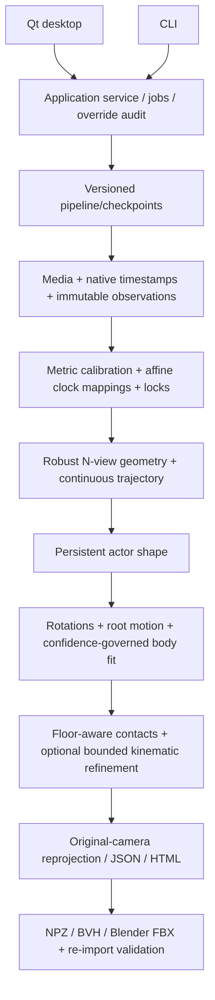

# Architecture

Numerical modules do not import UI. CLI and GUI call the same application service. A project stores explicit calibration, observations, versioned artifacts and audit overrides. Jobs run outside the GUI thread, report stage progress and support cancellation at safe boundaries. Raw detections/poses remain immutable; effective data equals raw data plus reversible overrides.

`types.py` carries metric cameras, distortion, trajectories, observations, body states, contacts, diagnostics and provenance. `ParameterControl` and source enums in `types.py` carry owner/state and evidence precedence; camera refinement, body fitting and optional refinement enforce those contracts. Surveyed/imported trusted camera parameters default to locked. Human-assisted camera refinement is bounded and diagnostic. Strong multiview joints constrain later fitting/refinement. The fixture and learned estimates never replace missing authoritative information silently.

Continuous motion uses native asynchronous rays and a differentiable spline basis rather than matching integer frame numbers. Outputs sample requested rates. Expensive stages persist metadata identifying inputs/config/code schema; edits invalidate downstream stages instead of silently reusing stale artifacts. See module documents for exact methods and current limits. Sparse multi-person evidence is represented by identity interfaces, but complete real multi-actor orchestration remains partial.
