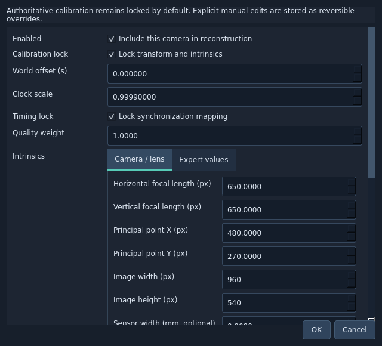

# Camera setup

Cameras is the primary camera-management table. It shows ID, source, resolution, source FPS, timestamp/calibration status, offset, drift, reprojection, quality, enabled state and calibration lock. Select a row to inspect its retained metadata. Double-click or use Edit selected… for corrections.

The editor exposes inclusion, authoritative calibration lock, clock offset/scale and timing lock, quality weight, Camera / lens and Transform. Camera / lens includes focal lengths in pixels, principal point, image dimensions, optional sensor/focal metadata, lens model and comma-separated distortion coefficients. Transform uses world-to-OpenCV-camera translation in metres and XYZ Euler angles in degrees. Expert values retains the complete numerical records when a technician needs them.

Sensor metadata is descriptive unless a technician explicitly converts it into calibrated pixel intrinsics. Do not expect editing focal millimetres alone to recalibrate the lens. Distortion uses OpenCV coefficient ordering; fisheye requires four coefficients.

Enable / disable changes whether a camera contributes to reconstruction. It preserves raw observations. Manual edits are stored as overrides, invalidate dependent results, and support Edit → Undo / Redo. Locked calibration is never silently changed by body fitting or learned inference. A deliberate manual edit creates new authoritative evidence; verify its residuals before solving.
