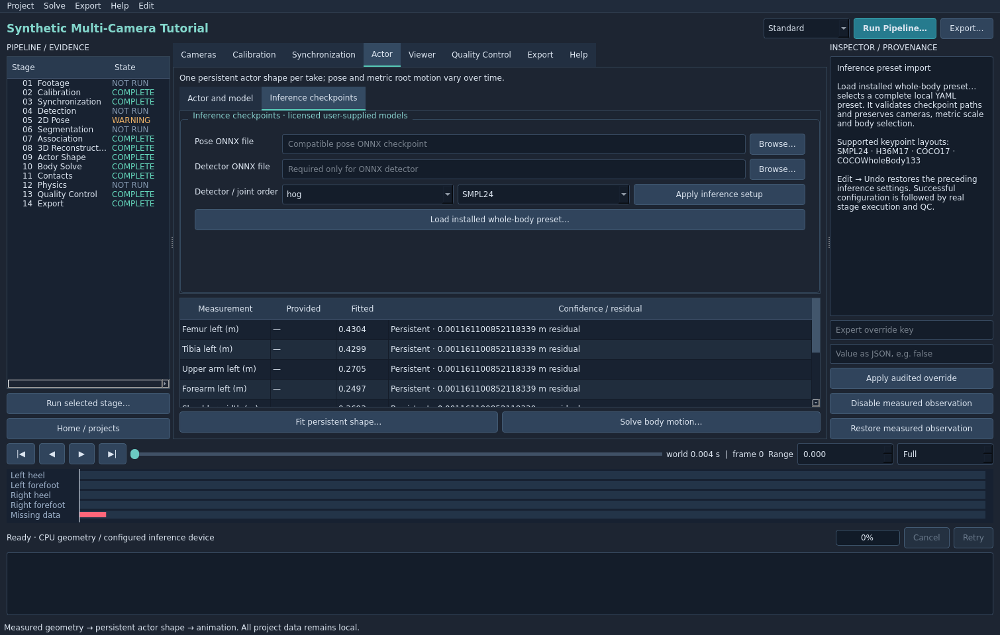

# 2D pose

Choose a compatible licensed pose ONNX checkpoint in Actor → Inference checkpoints. Select the checkpoint's actual joint layout: SMPL24, H36M17, COCO17 or COCOWholeBody133. Apply inference setup, then select 2D Pose and Run selected stage….

For a checkpoint distributed with a complete inference preset, use **Load installed whole-body preset…** instead of constructing its codec settings manually. The preset supplies model paths, landmark order and supported preprocessing/output settings together. Existing inference settings are retained unless the preset explicitly replaces them. Check the Inspector's model paths and landmark count after import. Presets may include detector and segmentation settings, but cannot overwrite camera or body parameters. The importer refuses missing checkpoint files, unresolved path placeholders, duplicate landmark names and unsupported settings before making an edit.

Select `configs/pose/rtmpose-wholebody-yolox.yaml` for the included public whole-body candidate after installing its separate checkpoints. The Inspector should show 133 landmarks and the local pose-model path, and the joint-order selector should read COCOWholeBody133. Review the candidate's model-license requirements before production use. Run Detection first, then 2D Pose; loading the configuration does not run either stage.

The adapter executes top-down inference from person crops and preserves confidence for every returned landmark. SimCC, heatmap and explicit XY-confidence outputs are supported by configured backends. The default expects SimCC. The COCOWholeBody133 layout preserves the model's 17 body, six foot, 68 face and 42 hand outputs in their original order. Applying the displayed inference setup retains that full layout and the preset's codec settings. This does not enable face/hand animation fitting by itself: the current body solve uses its configured skeletal joint mapping, while the additional raw landmarks remain available for reconstruction and QC. Models requiring a different codec, normalization or landmark definition need a complete compatible preset or technician setup through the expert configuration.

A mismatch between emitted joint count and supplied names fails explicitly. Midpoint-derived landmarks retain derived provenance and lower confidence; they are not relabeled as measured detector outputs.

Open Viewer, choose a plate layout, and enable Measured 2D and Confidence. Green means measured input; amber means reprojected solved geometry. Preserve uncertainty when hands or feet are occluded. Do not interpret a low-confidence interpolated limb as a direct observation.

Raw pose results remain separate from association/effective observations. Use non-destructive observation corrections when needed. The tutorial imports its known keypoints and shows WARNING for inference rather than pretending to have run a checkpoint.
