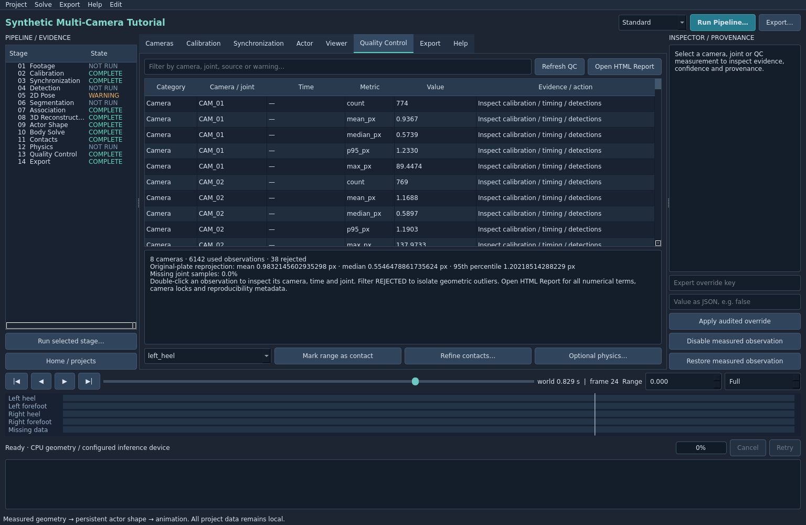

# Quality control

Open Quality Control after every solve. The table exposes camera/joint residuals and observation records. Type camera names, joint names or REJECTED into the filter. Column headers sort the table. Double-click an observation to jump to its camera/time and inspect its measured landmark.

The summary shows observation counts, rejected measurements, original-plate error distribution and missing samples. Open HTML Report provides full triangulation geometry, calibration quality, clock mappings, persistent-shape residuals, contacts, body-fit reprojection, locks, warnings and reproducibility information.

In Viewer, compare Measured 2D against Reprojected and enable Error vectors. Green is input, amber projection, red rejection and violet low-confidence/inferred information. The plate timestamp can differ from world time because clocks and dropped frames are handled explicitly.

A high-error camera suggests calibration, timing, resolution or identity problems. A high-error joint shared by many cameras suggests mapping/detection or body-fit problems. Errors concentrated in fast motion often indicate synchronization. Edge-of-frame distortion errors suggest the lens model.

Do not use one global mean to accept a take. Inspect percentiles, outliers, baseline/conditioning, missing regions and final fitted-body residuals. The table displays the first 5,000 observation records; the full machine-readable report retains complete diagnostics. STALE overlays identify recorded invalidations, and export refuses recorded stale solves. **Current limitation:** editing input/config files outside the application does not trigger export-time hash revalidation. Rerun the solve before exporting after an external edit. Native-PTS plate display and non-SMPL skeleton edges also have known gaps; see [PROJECT_STATE.md](../../PROJECT_STATE.md).
