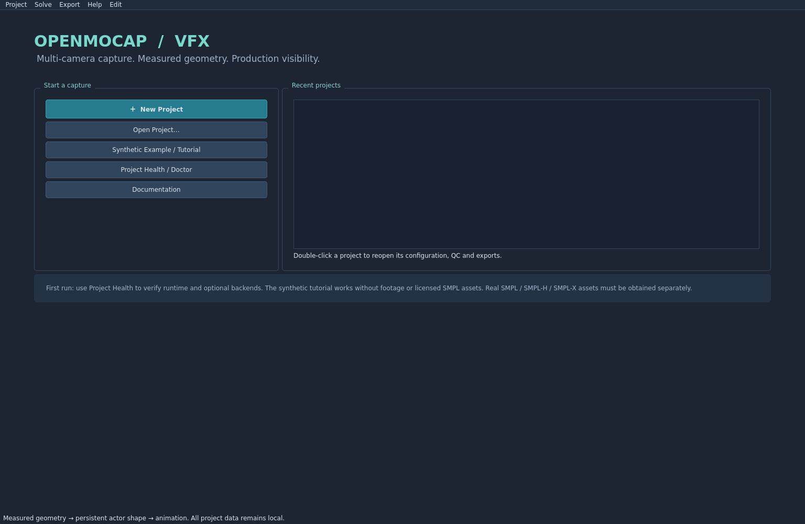
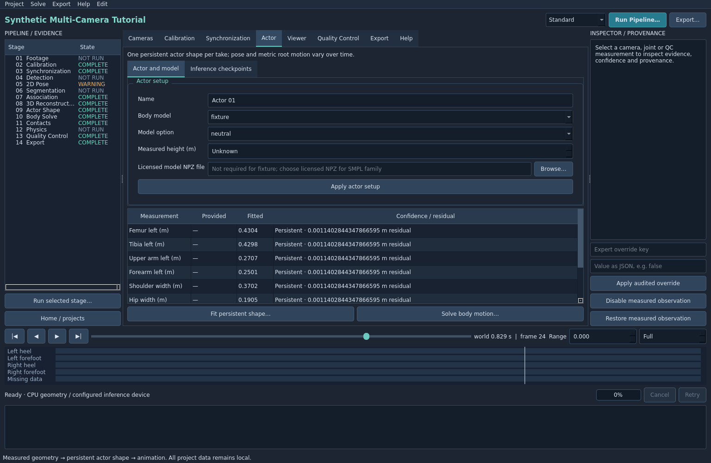
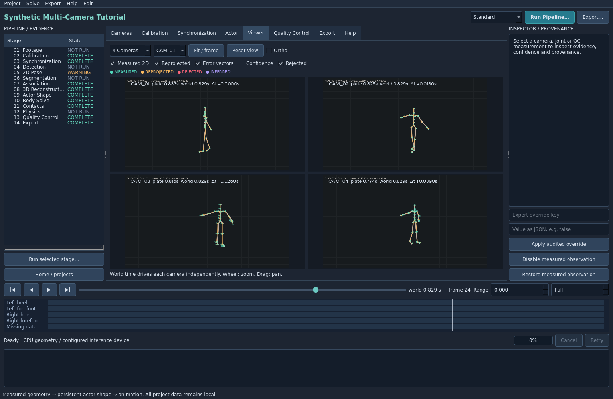

# Your First Multi-Camera Solve

This tutorial creates a local synthetic project and exports a genuinely rigged, skinned and animated FBX. It uses generated plates, calibrated cameras and known timestamped 2D keypoints. Detection/pose stages will explicitly report imported observations; the tutorial does not require or pretend to execute a pretrained model or licensed SMPL asset.

## 1. Launch and check the environment

Launch /workspace/openmocap-install/OpenMocap.sh. On first launch, review Project Health / first-run setup. The geometry runs on CPU. FBX additionally requires the Blender backend. Close the diagnostic window to use the project manager. You can rerun Project Health / Doctor later.

## 2. Create the example project

Choose Synthetic Example / Tutorial. Select a writable parent directory, preferably /workspace/openmocap-install/projects. The application creates synthetic-tutorial beneath it, with registered image sequences, measured camera metadata, asynchronous keypoints and the explicitly selected fixture body model. Generation runs as a background job. Wait for the project workspace to open.

Use a fresh parent folder if an existing tutorial contains edits you want to preserve. Example generation writes generated fixture inputs; it is not the New Project wizard for real footage.

## 3. Inspect imported cameras and calibration

Open Cameras. Verify camera IDs, source directories, image dimensions, enabled state and calibration locks. The example already registered its camera images; no external footage registration is necessary.

Open Calibration. Inspect the actual frustums and metric floor. Click Run calibration stage… and confirm its review. This validates the supplied camera geometry. Keep authoritative cameras locked. The example establishes metres and +Y up from its generated ground truth.

## 4. Verify asynchronous timing

Open Synchronization. Inspect camera offsets, scale/drift and timing locks. The example deliberately includes native asynchronous sampling. Do not reset those offsets to zero or assume source frame numbers match.

Run synchronization stage… if you want to inspect the explicit mapping stage. Known locked mappings are preserved. Later, tiled playback shows each camera's actual plate timestamp at the shared world time.

## 5. Review detection and 2D pose inputs

Select Detection in the navigator and Run selected stage…. Read the warning that known imported keypoints are available and neural inference did not execute. Repeat for 2D Pose if desired. These WARNING states are honest provenance, not a failed geometry demo.

Real RGB projects configure compatible local ONNX checkpoints in Actor → Inference checkpoints before executing these stages. The tutorial already contains measured keypoints, so do not select an unrelated checkpoint.

Segmentation is not needed for this joint-driven solve and can remain NOT RUN. Selecting Association with these imported synthetic actor IDs likewise reports imported data; the downstream geometric solve retains the supplied identity.

## 6. Reconstruct and fit the actor

Choose Standard in the toolbar, then Run Pipeline…. The review lists cameras, selected range, output FPS, compute path and completed stages. Leave End at Full for the first solve. Confirm and wait for completion.

The real pipeline reconstructs N-view joints, fits continuous motion, estimates persistent proportions, solves the character, infers contacts and writes QC. Watch the Jobs/progress/log area; cancellation is cooperative and completed checkpoints remain available.

In Actor → Actor and model, confirm Body model is fixture. Its missing licensed-model file is expected. The fitted dimensions table describes the same actor throughout the take. The separate Fit persistent shape… and Solve body motion… actions are available when reprocessing changed inputs.

## 7. Compare the solved motion against plates

Open Viewer → 3D Scene. Use Fit / frame. Drag to orbit, Shift-drag to pan and wheel to zoom. Scrub, play/pause and step the world timeline. The viewport contains the fitted skinned mesh, skeleton, floor and calibrated cameras.

Switch to 4 Cameras. Enable Measured 2D, Reprojected, Error vectors and Rejected. Green denotes measured keypoints, amber solved projections, red rejected evidence and violet inference/low confidence. A camera's selected plate timestamp can differ from world time.

## 8. Inspect QC and try a reversible correction

Open Quality Control. Filter by a camera or joint. Double-click an observation row to navigate to that camera/time. Open HTML Report to review geometric and fitted-body reprojection separately, rejected views, missing samples, locks and contact diagnostics.

To try a manual correction, click a measured green landmark in the plate viewer, then Disable measured observation in the inspector. The source file is retained and downstream states become STALE. Use Edit → Undo or Restore measured observation, then rerun Run Pipeline… before export. Undo restores the edit but does not falsely declare old results current.

The four contact tracks may contain no reliable planted interval in a short section; a blank track is a valid result. Optional contact/kinematic refinement can be exercised later after reviewing the floor and evidence.

## 9. Export and validate the character

Choose Export…. Select fbx, then an output path such as /workspace/openmocap-install/projects/synthetic-tutorial/exports/actor.fbx. Keep the project's output FPS, full time range, mesh inclusion, camera metadata and Validate exported file enabled. Use Metric +Y world for this tutorial.

Confirm. The background exporter creates the weighted character and re-imports it into a clean Blender scene. Wait for EXPORT VALIDATED. If validation fails, read the detailed job error; the mere presence of an FBX file does not establish a valid character.

Repeat with npz if you want the numerical rig/body data, or bvh for skeleton-only interchange. USD is unavailable with the installed Blender backend; it is not part of this tutorial.

## 10. Save and reopen

Project → Save Project, then Home / projects. Double-click the tutorial under Recent projects and inspect the loaded solve/QC. Open output folder opens the project solve artifacts, including outputs/qc/report.json and report.html. The FBX and its validation sidecar remain at the export path you selected.

The automated desktop test follows this same service-backed path with three asynchronous cameras and 12 input frames, native media display, QC, validated NPZ and Blender FBX export, persisted overrides and raw-file preservation. It is recorded in tests/integration/test_ui.py. Follow [BUILD_STATUS](../BUILD_STATUS.md) for current external blockers and advanced UI limitations.

The CLI equivalent is:

    source /workspace/openmocap-install/openmocap-vfx/scripts/activate.sh
    cd /workspace/openmocap-install/openmocap-vfx
    openmocap demo --output outputs/demo --cameras 8 --frames 36
    openmocap gui outputs/demo
    openmocap export outputs/demo --format fbx --output outputs/demo/exports/actor.fbx
